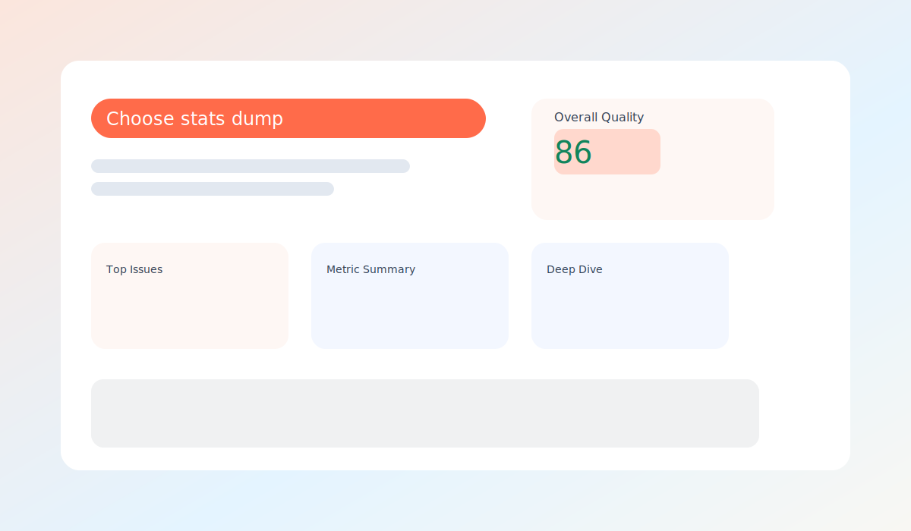

# WebRTC Stats Analyzer

A static React + Vite SPA to parse Chrome WebRTC stats exports (`webrtc-internals` and `RTCStatsDump`) and produce a quality diagnosis with charts and tables.

## What It Does
- Detects input format and parses stats dumps in-browser.
- Normalizes metrics for audio/video tracks (inbound/outbound).
- Computes a 0–100 heuristic quality score and top issues list.
- Renders summary tables and time-series charts.

## Demo Screenshot

## Supported Inputs
- Chrome `webrtc-internals` export JSON (`webrtc_internals_dump.txt`)
- `RTCStatsDump` text export (`rtcstats_dump.txt`)

## Run Locally
1. `npm install`
2. `npm run dev`
3. Open the Vite URL and upload a dump file.

## Tests
- `npm test`

## Project Structure
- `src/lib/parse` - format detection + parsers
- `src/lib/scoring.ts` - heuristic scoring
- `src/lib/summary.ts` - summary aggregation and issues
- `src/components/MetricChart.tsx` - Chart.js wrapper
